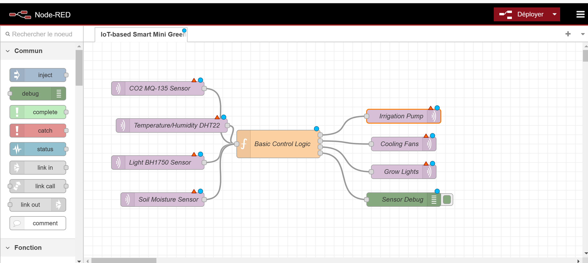

# README for IoT-based Smart Mini Greenhouse

## Overview

This project is developed and maintained by IoT-Experts as part of a professional contract under Canadian law. It adheres to advanced architectural software principles, showcasing our expertise in scalable IoT solutions for agricultural applications.

The architecture follows a distributed system model combining event-driven and modular design approaches. Each subsystem operates independently while sharing real-time data via MQTT and RESTful APIs to ensure robustness, scalability, and ease of maintenance.

This project is developed and maintained by IoT-Experts as part of a professional contract. It aims to showcase our expertise in creating scalable and efficient IoT solutions tailored for agricultural applications.

This document outlines the features and enhancements of the IoT-based Smart Mini Greenhouse project. The goal of this project is to provide a scalable, efficient, and technologically advanced solution for greenhouse management using IoT technologies. It emphasizes a modular design for adaptability, advanced data analytics, and robust security measures to ensure effective performance.

## Key Features

### Architectural Diagram

Below is a high-level architectural overview of the Smart Greenhouse system:

1. **Sensors and Actuators**:

   - Sensors: CO2 (MQ-135), Temperature/Humidity (DHT22), Light (BH1750), Soil Moisture.
   - Actuators: Irrigation Pump, Cooling Fans, Grow Lights.

2. **Communication Protocols**:

   - MQTT for sensor and actuator data transmission.
   - RESTful APIs for remote control and data retrieval.

3. **Middleware**:

   - Node-RED for processing and visualizing data.
   - Cloud platform (e.g., Blynk™) for dashboards and remote monitoring.

4. **Client Access**:

   - Mobile and web interfaces for real-time data visualization and control.

### Architectural Highlights

- **Event-Driven Architecture**: Real-time updates and data synchronization across sensors and actuators.
- **Modular Design**: Each module (e.g., CO2 monitoring, irrigation control) operates independently to simplify maintenance and scalability.
- **Cloud Integration**: Connects with IoT platforms like Blynk™ for real-time dashboards and remote control.
- **Security-Centric Design**: Implements TLS for data encryption and role-based access control for operational security.

### 1. Advanced Environmental Monitoring

- **CO2 Sensors (MQ-135)**: High-precision sensors monitor carbon dioxide levels to ensure optimal photosynthesis conditions for plant growth.
- **UV Radiation Measurement**: Maintain and adjust UV exposure for maximizing plant health and productivity with real-time calibration.
- **Temperature and Humidity Sensors (DHT22)**: Real-time data acquisition to ensure stable climate control.
- **Soil Moisture Sensors**: Maintain optimal soil conditions for plant health.
- **Light Sensors (BH1750)**: Monitor light intensity to ensure plants receive the optimal amount of light.

### 2. Energy Efficiency Enhancements

- **Solar Panels**: Implement photovoltaic systems to reduce reliance on traditional energy sources and power the greenhouse sustainably.
- **Battery System**: Lithium-ion battery storage ensures uninterrupted operation during low sunlight periods with adaptive load balancing.

### 3. Water Management

- **Automated Irrigation**: Integrate advanced soil moisture sensors to dynamically regulate watering schedules and minimize water waste.
- **Rainwater Harvesting**: Optimize water usage with automatic rainwater collection systems for environmental sustainability.

### 4. Data Analytics and Insights

- **AI-Based Analytics**: Leverage machine learning algorithms to predict plant growth trends, detect anomalies, and optimize greenhouse conditions.
- **Real-Time Alerts**: Deploy a notification system to immediately inform users of deviations in temperature, humidity, or CO2 levels via mobile and web platforms.

### 5. Scalability for Professional Use

- **Modular Design**: Expandable architecture allows seamless integration of additional modules like larger panels or additional greenhouses.
- **Centralized IoT Platform**: Manage and synchronize operations across multiple greenhouses with a unified dashboard for streamlined control.

### 6. Security and Data Privacy

- **Encrypted Communication**: Employ industry-standard TLS encryption protocols to secure data transfer between sensors and the central platform.
- **Role-Based Access Control**: Implement granular access permissions for administrators, technicians, and users to ensure operational integrity.

### 7. Remote Control and Automation

- **Mobile and Web Control**: Accessible user interfaces provide full control over greenhouse parameters from any device with connectivity.
- **Automated Responses**: AI-driven automation adjusts environmental variables, such as activating fans for cooling, irrigation for soil moisture, or adjusting light intensity based on predefined thresholds.

## Installation and Setup

### Architectural Style

The software for this project adheres to a hybrid architectural style combining **event-driven architecture**, **client-server models**, and **modular microservices**. This ensures:

- Real-time synchronization of environmental data across all connected sensors and actuators via MQTT.
- Scalability through independent microservices managing specific features (e.g., irrigation, temperature control).
- Secure client-server communication for remote monitoring and control via IoT platforms like Blynk™.

1. **Hardware Requirements**:

   - NodeMCU ESP8266 microcontroller for IoT communication.
   - DHT22 (temperature and humidity sensor) with high accuracy.
   - BH1750 (light sensor) with wide lux range.
   - Hygrometer (soil moisture sensor) for precise irrigation control.
   - MQ-135 (CO2 sensor) for air quality monitoring.
   - Solar panel and battery setup (optional but recommended).

2. **Software Requirements**:

   - Node-RED for flow-based visual programming.
   - MQTT for lightweight and reliable messaging between devices.
   - Blynk™ IoT platform for a user-friendly dashboard and real-time monitoring.

3. **Steps to Install**:

   - Connect and configure the hardware components according to the manual.
   - Install Node-RED and add required nodes for dashboard and data management.
   - Deploy the Node-RED flow provided to handle sensor data and automate processes.
   - Link the setup to the Blynk™ platform to monitor conditions remotely and receive alerts.

4. **Node-RED JSON Flow**:

   - The Node-RED JSON flow provided includes the following features:
     - Integration of CO2, temperature, humidity, soil moisture, and light sensors.
     - Automated irrigation triggered by soil moisture levels.
     - Real-time visualization of all metrics using gauges and charts.
     - MQTT for communication between sensors, actuators, and the central server.

## Usage

- Continuously monitor environmental data through intuitive dashboard visualizations.
- Utilize predictive analytics to make data-driven adjustments to greenhouse operations.
- Access historical data to refine strategies for maximizing resource efficiency and plant growth.
- Use AI-driven automation to handle repetitive tasks, reducing manual intervention.

## Contribution

### Professional Workflow

As this project is part of a contractual agreement under Canadian law with IoT-Experts, the following workflow applies:

1. **Submitting Changes**:

   - All changes or issues must be submitted via GitHub with detailed documentation.
   - Each submission should include a pull request describing the purpose and scope.

2. **Project Management**:

   - IoT-Experts uses tools like Jira or Trello to manage tasks and milestones.
   - Contributors are expected to log their progress and align with project timelines.

3. **Approval Process**:

   - External contributions require prior written approval.
   - Approved contributions must adhere to confidentiality and intellectual property clauses.

For collaboration opportunities or inquiries about contributing, please contact IoT-Experts directly. All contributions must undergo rigorous testing and adhere to established professional standards.

As this project is part of a contractual agreement under Canadian law with IoT-Experts, it is subject to the terms and conditions specified in the contract. Contributors are required to:

- Submit changes or issues via GitHub, detailing the scope and purpose of the modification.
- Align all submissions with the intellectual property and confidentiality clauses outlined in the contract.
- Use project boards (e.g., Trello or Jira) to track tasks and milestones, ensuring transparency and professional workflow alignment.

External contributions are only permissible upon prior written approval by IoT-Experts. Please contact us directly to discuss potential collaboration opportunities or inquiries about contributing to the project. All modifications must adhere to established contribution guidelines and undergo rigorous testing to meet professional standards.

## License

This project is licensed under a custom proprietary license. Please contact the project owner for detailed licensing terms and restrictions.

## Flow Node-RED

Voici un aperçu du flow Node-RED utilisé pour ce projet :

